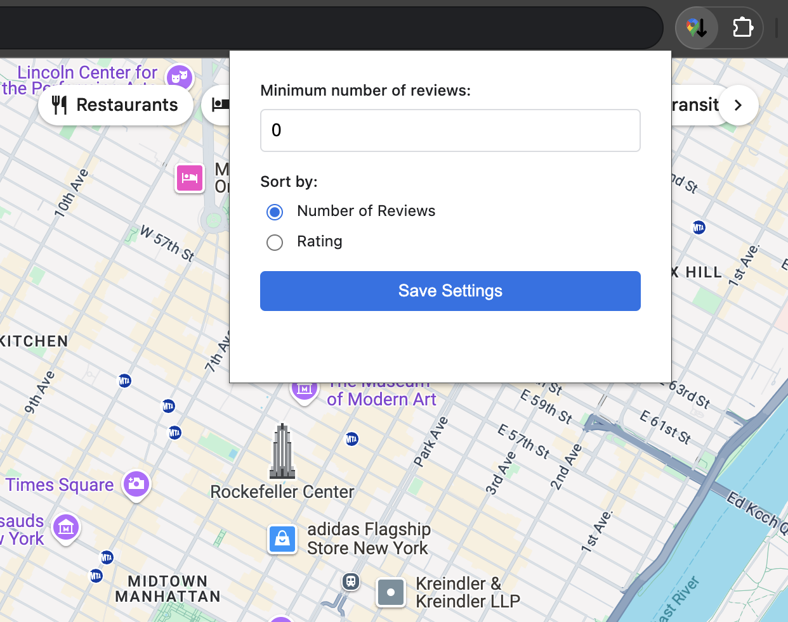

# Google Maps Sorter
Sort Google Maps results by the number of reviews and rating.

(Click on the image to see a full video example on YouTube)

This extension adds the sorting button on the bottom right part. To use it:
* Search for what you want.
* Scroll down through the search results to fetch as many results as you want. This is because the sorting happens only on the client side.
* Click on the sorting button.
* You can configure the sorting by the number of reviews (default) or by the rating. In addition you can choose to filter results with a minimum number of reviews.

### Creating the Zip file:

'''console
zip -r extension.zip manifest.json src images -x images/promo.png -x images/config.png -x images/button.png -x images/.DS_Store -x extension.zip
'''