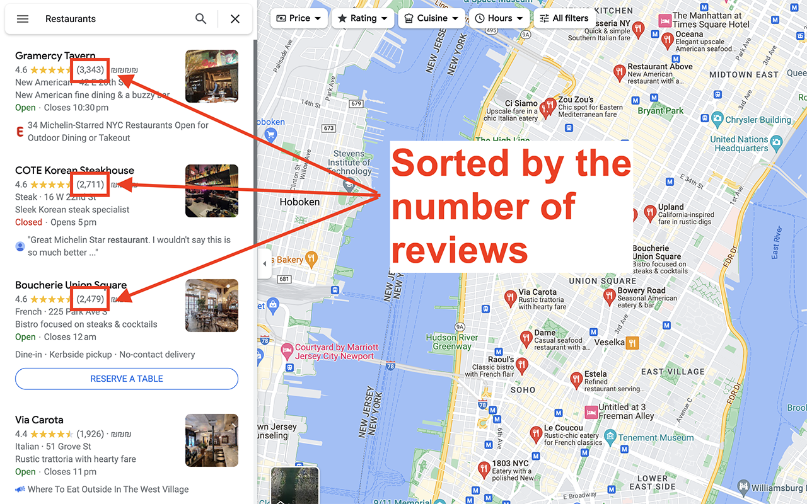

# Google Maps Sorter
Sort Google Maps results by the number of reviews.

(Click on the image to see a full video example on YouTube)

This extension adds the sorting button on the bottom right part. To use it:
* Search for what you want.
* Scroll down through the search results to fetch as many results as you want. This is because the sorting happens only on the client side.
* Click on the sorting button and go back to the top.

